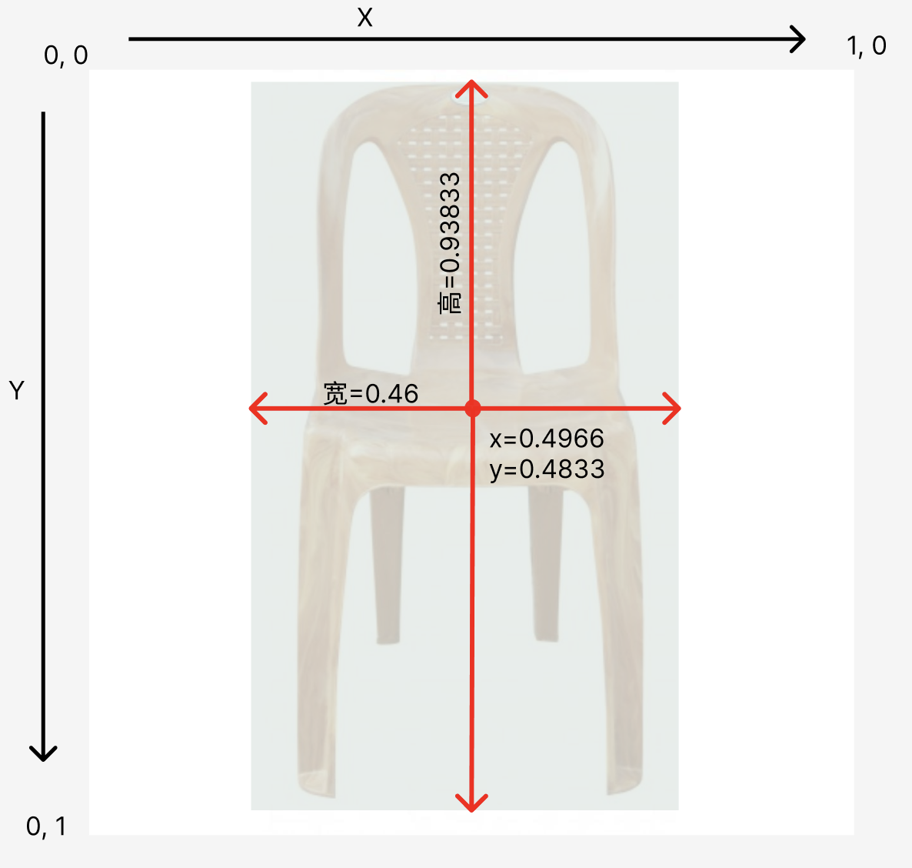

## 缘起

最近因为公司项目的原因，重新接触了下 Machine Learning, 说的更具体一点是深度学习。然后我自己从Pytorch开始学习，到挑选模型进行进行训练，然后移植到iOS上做了简单的Demo。在这个整个流程中我也看了不少教程，发现了这些教程中的几个问题:

- 对于普通程序员，ML领域还是很大，很多，稍微不留神就会陷到其中一个方面，跳不出来，迟迟没发下手。但是不了解一点的话，尤其是遇到模型修改，训练这种工程方面的事情的时候，又不会怎么做了。
- 有些ML的教程过于数学公式化，不是说不好，对于我这种没有任何ML知识基础的人，确实看不大进去。
- 将模型应用到iOS平台的时候，包括苹果官方给的Demo例子都是Storayboard的页面代码，而不是SwiftUI，对于像我这种新手程序员不友好，毕竟从学习和维护方便，SwiftUI更简单和方便。因为是新手，所以不太会用UIKIT来做很fancy的App, 大家别用SwiftUI性能不好来杠我。

## 背景介绍

这个系列会以 [YOLO](https://pjreddie.com/darknet/yolo/) 这个目标检测模型为例子。YOLO 这个ML模型的作用主要是为了进行目标检测，会告诉你图片里面有哪些东西，比如苹果，香蕉，人等等，并使用一个方框标记起来。类似这样的效果:


苹果[官方](https://developer.apple.com/machine-learning/models/)就有 YOLOv3 这个模型，小巧实用。另外它还有 YOLOv4, YOLOv5, YOLOv7, YOLOv8, YOLOv9。更搞笑的是一个哥们的项目名字直接是`YOLO9000`，看谁的版本号大，让Nodejs，chrome，firefox这些版本号狂魔看着都傻眼。

另外扯个闲篇，YOLO从v5版本后发生了很大的变化，因为之前的版本都是用C写的，从这个版本开始用Python写，也增加了很多功能，易用性大大提高，项目也从原来的项目脱离。当时大家拿这个版本和之前的版本进行对比，引起了很大的争议，可以看这个[帖子](https://medium.com/augmented-startups/YOLOv5-controversy-is-YOLOv5-real-20e048bebb08)，很有意思。

好了，这篇文章最终要使用自有的数据集来训练一个可以鉴别家具类型的ML模型。跟ML相关的内容，也会穿插着在细节里面说，不会很深入，所以大家不用太发怵。

## 数据准备

### 数据下载

[roboflow](https://roboflow.com/) 这个网站有一些公开的数据集用来进行自己训练，或者学术研究，具体在[这里](https://public.roboflow.com/)。这里我们选择[家具](https://universe.roboflow.com/roboflow-100/furniture-ngpea)这个已经标注好的数据集。点击按钮直接下载，注意要下载 `YOLOv8` 格式的数据集zip包下载。


简单说下 roboflow 这个网站，你可以将自己没有标注的图片，直接上传上去，然后用它的平台进行手动标注，然后按照一定标准导出数据集供模型训练，体验不错，免费使用。相关的流程可以看[这里](https://blog.roboflow.com/how-to-train-yolov8-on-a-custom-dataset/)的`Preparing a custom dataset for YOLOv8`的章节。

### 数据说明

解压zip后，我们来看看里面的文件夹内容。


文件夹中我们会发现有个data.yaml的文件，这个文件是对整个数据集情况的说明。具体内容如下:

```yaml
train: ../train/images
val: ../valid/images
test: ../test/images

nc: 3
names: ["Chair", "Sofa", "Table"]

roboflow:
  workspace: roboflow-100
  project: furniture-ngpea
  version: 2
  license: CC BY 4.0
  url: https://universe.roboflow.com/roboflow-100/furniture-ngpea/dataset/2
```

下面就上面的字段进行简单的说明：

- train，val，test分别是训练，验证，测试图片的路径说明。`这里我们需要修改成电脑中真正的绝对路径`, 假设放到了 `/Users/danieljia/datasets` 文件夹下面。一般来说val不是非常必要的，但是train和test必须要有，他们的数据量遵循8:2原则。这里的数据量说的是图片数量和图片中出现的目标（家具）所在图片中的坐标和类型索引值。
- nc 是数据中标记出来的目标类型数量，目前是3种
- names 是数据中标记出来的目标名字数组。

另外对于文件夹中的其他子文件夹，我们可以看到 test, val, train 下面都有2个文件夹，一个叫 images, 其实就是对应的训练图片，另一个叫 labels，这里面的内容很有意思。我们打开一个看看。比如第一个图片`Chairs--1-_jpg.rf.7104107727daae1f8c000a66cf0dd7b1.jpg`对应的label `Chairs--1-_jpg.rf.7104107727daae1f8c000a66cf0dd7b1.txt`，内容如下:

```
0 0.49666666666666665 0.48333333333333334 0.46 0.9383333333333334
```

- 首先，数据中的第一个`0`的意思是说能从图片里面识别出来的物体在`["Chair", "Sofa", "Table"]`数组中的索引位置是0，也就是 Chair。

- 然后就是后面4个数字的意思。下面用一张图来解释下这几个数字的意思。
  
  其中左上角是坐标系的起点，往右是X，往下是Y。前面2个说的是识别出来的物体的外部标注框的中心坐标位置，第三个说的是标注框的宽，第四个说的是标注框的高。

  注意图片的高和宽都是640px，那为何这里的坐标都是0-1的数字呢，因为这样的话不管图片多大，它的数据结构都是0-1的数字，减小计算量，也是为了让模型做到图片尺寸无关。这个做法有个统一的称呼：归一化(Normalization)。

  那怎么做归一化处理呢？很简单，标注框的中心坐标点是(317, 309), 整个图片的高和宽都是640px, 那么直接(317/图片宽，309/图片高)就得到了上面数据中的 (0.4966, 0.48333) 这个归一化的坐标点了。

## 训练

经过上面的数据准备，我们已经设置好了`data.yaml`文件，准备好了数据，下面就开始训练咱们自己的模型了。

### 环境

训练之前我要先把我自己的训练环境列一下:

- Python: 3.11.4
- Macbook M2 Air
- ultralytics: 8.1.29
- pytorch: 2.2

首先先安装相关的Python库:

```shell
pip install -U ultralytics
pip install -U pytorch
```

### 如何训练

然后下面就是训练模型的代码:

```python
from ultralytics import YOLO

# 如果你使用的是 NVIDIA GPU的话可以使用这个代码进行判断
device = "cuda" if torch.cuda.is_available() else "cpu"

# 如果你使用的是M系列的芯片macbook，请使用下面的代码。但是我在我自己的电脑上发现MPS貌似没有起作用，因为训练的速度比CPU还慢。
# device = "mps" if torch.backends.mps.is_available() else "cpu"

# 加载预训练模型
model = YOLO('yolov8n.pt')
# 根据自有的数据训练模型
results = model.train(data='/Users/danieljia/datasets/data.yaml', epochs=50, batch=16, imgsz=640, device=device)
```

下面开始解释下相关的细节。

- `ultralytics` 这个库目前使用的就是yolov8的版本，它还支持导出模型到iOS中使用，很方便，不过需要注意它的`License`。这个公司/组织有不少跟yolo相关的库，各种新的特性支持的挺快的。大家可以去[看看](https://docs.ultralytics.com/)。
- 正如注释里面说到的那样，我用我自己的M2的电脑训练的时候，发现它并没有识别出来我的M芯片，比cpu训练的还慢，不知道是什么原因。这个时候你可以直接让`device="cpu"`就行了。
- `cuda` 就是 NVIDIA 的 GPU。如果你有的话，推荐用这个训练，速度很快。
- `yolov8n.pt`是Pytorch类型的文件，一般称为 weight 文件, 这里作为我们的`预训练`模型。那么这个预训练模型有啥用呢？你可以简单的认为它已经存了一些模型的各种调参值了，然后我们只需要把新的数据+预设的模型参数，再一起训练下，就会得到新的微调后的参数文件(pt文件)。因为不同的数据集如果想得到最好的结果，可能都会进行一些微调，这里说的可能就是神经网络的层的参数调整了。
- 最后我们看下 `model.train` 里面的参数。
  - data说的就是上一节我们整理好的yaml文件的路径。
  - imgsz说的是训练图片的大小，一般都是正方形，图片都是640px的，所以写640就行了。
  - 最后是`epochs`这个参数。这个是说整个数据集往模型里面放多少轮次。每放一次，模型就会调整一下，至于设置多少最好，具体情况具体分析，目前这里写的50， 大家可以改成100看看。但是这个数字越大，训练的时间也会变长，有可能导致过拟合，就是训练的太好了，模型只是适合训练数据，测试数据表现的不好。但是如果设置的太小，可能会没有训练完全，没有提取到数据真正的特性，导致识别的时候效果不好。
  - batch说的是因为训练数据比较大，那么每个`epochs`轮次，会把数据按batch的数量分成多块，然后这样可以提高效率，减轻系统压力。
  - 另外它还有一些别的参数，大家可以参考[这里](https://docs.ultralytics.com/modes/train/#train-settings)

另外还会产出一些训练结果的验证指标，连同模型文件会存在一个地方。这个指标我会新写一篇，整理好了再发出来。

## 验证

如果使用GPU的话，应该大概是20分钟左右的样子。训练完毕后，模型文件还是pt格式，存储路径训练的日志会显示出来。假设存储到了 `/Users/danieljia/yolo/best.pt` 里面去了。
那我们拿一个图片来进行验证。

```python
from ultralytics import YOLO

# 加载训练好的模型
model = YOLO('/Users/danieljia/yolo/best.pt')
results = model(['im1.jpg'])
results[0].show()
```

## 总结

这一篇文章通过使用自定义的图片数据，训练了一个目标检测模型，并进行了相关步骤和名次的解释。下一篇我会讲一下，如何集成到iOS的SwiftUI项目中。敬请期待。
另外就是如果文章里面有哪里没说太明白的，或者说的不对的地方，麻烦大家留言反馈下。

## 参考资料

如果大家对Pytorch感兴趣的话，强烈推荐大家看看这个 [Zero to Mastery](https://www.learnpytorch.io/00_pytorch_fundamentals/) 的 [00](https://www.learnpytorch.io/00_pytorch_fundamentals/), [01](https://www.learnpytorch.io/01_pytorch_workflow/)章节。讲的浅显易懂，并且还有课后练习，建议那个也做了，它从工程角度将一些机器学习的一些概念讲的很实用，还有就是它把机器学习的涉及到的`工作流程`用代码的例子讲的很清楚。推荐大家去看看，有能力的话，可以把全部的章节都看了，动手也实践了。
