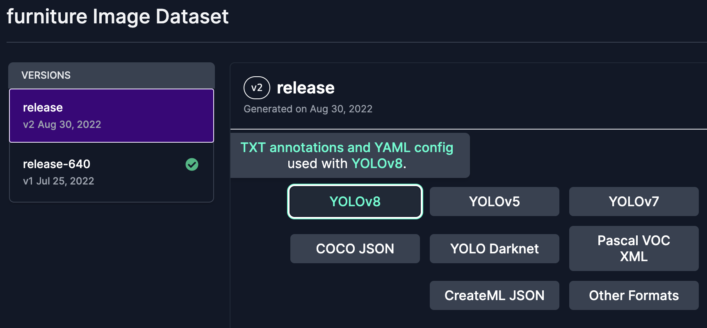

## 缘起

最近因为公司项目的原因，重新接触了下 Machine Learning, 说的更具体一点是深度学习。因为深度学习大部分情况下都要用到Pytorch这个框架，从 `Learning by doing` 的学习方法来看，我打算从这个框架入手，从认识ML，到搭建模型，利用定制数据重新训练模型， 然后移植到iOS上，使用SwiftUI完成一个简单的demo。所有的这些过程写一个小系列，给自己总结下，也是为了分享下，可能大家也有类似的问题。简单声明下，文章不会很深入ML的原理，偏向于程序员实用角度。

为啥是SwiftUI? 因为我目前只会这个，不会UIKit， 而且我看了之前包括苹果自己的涉及到机器学习的Demo项目，里面还是用的storyboard，相当落后，代码看着头晕，远没有SwiftUI好理解。

## 背景介绍

这个系列会以 [YOLO](https://pjreddie.com/darknet/yolo/) 这个目标检测模型为例子。YOLO 这个ML模型的作用主要是为了进行目标检测，会告诉你图片里面有哪些东西，比如苹果，香蕉，人等等，并使用一个方框标记起来。类似这样的效果:


苹果[官方](https://developer.apple.com/machine-learning/models/)就有 YOLOv3 这个模型，小巧实用。另外它还有 YOLOv4, YOLOv5, YOLOv7, YOLOv8, YOLOv9。更搞笑的是一个哥们的项目名字直接是`YOLO9000`，看谁的版本号大，让Nodejs，chrome，firefox这些版本号狂魔看着都傻眼。

另外扯个闲篇，YOLO从v5版本后发生了很大的变化，因为之前的版本都是用C写的，从这个版本开始用Python写，也增加了很多功能，易用性大大提高，项目也从原来的项目脱离。当时大家拿这个版本和之前的版本进行对比，引起了很大的争议，可以看这个[帖子](https://medium.com/augmented-startups/YOLOv5-controversy-is-YOLOv5-real-20e048bebb08)，很有意思。

好了，这篇文章最终要使用自有的数据集来训练一个可以鉴别家具类型的ML模型。

## 数据准备

[roboflow](https://roboflow.com/) 这个网站有一些公开的数据集用来进行自己训练，或者学术研究，具体在[这里](https://public.roboflow.com/)。这里我们选择[家具](https://universe.roboflow.com/roboflow-100/furniture-ngpea)这个已经标注好的数据集。点击按钮直接下载，注意要下载 `YOLOv8` 格式的数据集zip包下载。



简单说下 roboflow 这个网站，你可以将自己没有标注的图片，直接上传上去，然后用它的平台进行手动标注，体验不错，免费使用。相关的流程可以看[这里](https://blog.roboflow.com/how-to-train-yolov8-on-a-custom-dataset/)的`Preparing a custom dataset for YOLOv8`的章节。

解压zip后，我们来看看里面的文件夹内容。


文件夹中我们会发现有个data.yaml的文件，这个文件是对整个数据集情况的说明。具体内容如下:

```yaml
train: ../train/images
val: ../valid/images
test: ../test/images

nc: 3
names: ["Chair", "Sofa", "Table"]

roboflow:
  workspace: roboflow-100
  project: furniture-ngpea
  version: 2
  license: CC BY 4.0
  url: https://universe.roboflow.com/roboflow-100/furniture-ngpea/dataset/2
```
